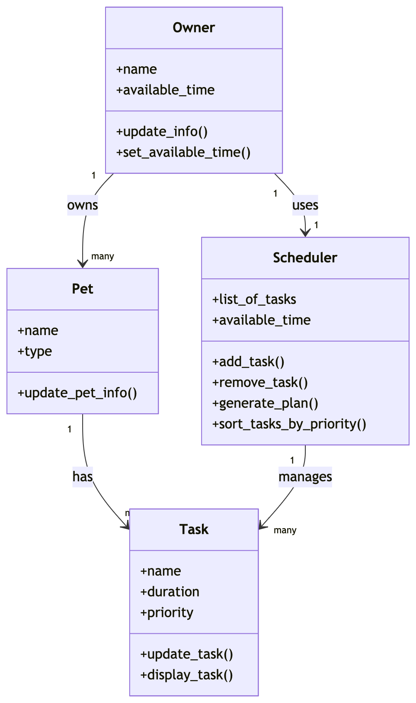
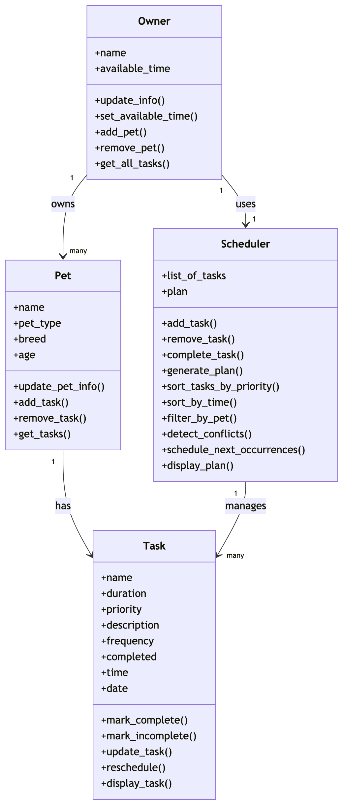

# PawPal+ (Module 2 Project)

You are building **PawPal+**, a Streamlit app that helps a pet owner plan care tasks for their pet.

## Scenario

A busy pet owner needs help staying consistent with pet care. They want an assistant that can:

- Track pet care tasks (walks, feeding, meds, enrichment, grooming, etc.)
- Consider constraints (time available, priority, owner preferences)
- Produce a daily plan and explain why it chose that plan

Your job is to design the system first (UML), then implement the logic in Python, then connect it to the Streamlit UI.

## What you will build

Your final app should:

- Let a user enter basic owner + pet info
- Let a user add/edit tasks (duration + priority at minimum)
- Generate a daily schedule/plan based on constraints and priorities
- Display the plan clearly (and ideally explain the reasoning)
- Include tests for the most important scheduling behaviors

## Getting started

### Setup

```bash
python -m venv .venv
source .venv/bin/activate  # Windows: .venv\Scripts\activate
pip install -r requirements.txt
```

### Suggested workflow

1. Read the scenario carefully and identify requirements and edge cases.
2. Draft a UML diagram (classes, attributes, methods, relationships).
3. Convert UML into Python class stubs (no logic yet).
4. Implement scheduling logic in small increments.
5. Add tests to verify key behaviors.
6. Connect your logic to the Streamlit UI in `app.py`.
7. Refine UML so it matches what you actually built.

## Smarter Scheduling

This project includes improved scheduling features:
- Tasks can be sorted by time and priority
- Tasks can be filtered by pet and completion status
- Recurring tasks (daily and weekly) are automatically rescheduled
- Conflict detection warns when tasks share the same time

These features make the scheduler more efficient and realistic for daily pet care planning.

## Testing PawPal+

Run all tests with:
```bash
python -m pytest
```

### What is tested
- Task sorting by time and priority
- Recurring tasks (daily and weekly)
- Conflict detection (duplicate task times)
- Scheduling logic with limited available time
- Edge cases (empty pets, no tasks, zero time available)

### Confidence Level
★★★★★ (5/5)

All automated tests passed successfully.

## Features

- **Task Management System** – Add, edit, and remove pet care tasks for each pet.
- **Priority-Based Scheduling** – Uses a greedy algorithm to schedule higher priority tasks first.
- **Time-Based Sorting** – Sorts tasks by scheduled time (HH:MM); tasks without time are placed last.
- **Daily Plan Generation** – Creates an optimized daily schedule based on available time.
- **Multi-Pet Support** – Supports multiple pets under one owner and combines their tasks.
- **Conflict Detection** – Detects and warns when tasks have overlapping start times.
- **Recurring Tasks** – Automatically reschedules daily (+1 day) and weekly (+7 days) tasks.
- **Task Completion Tracking** – Completed tasks are removed from scheduling.
- **Filtering by Pet** – Allows viewing tasks for a specific pet.

## UML Diagrams

### Initial UML Diagram
<a href="images/InitialUMLDiagram.png" target="_blank">
  
</a>

### Final UML Diagram
<a href="images/FinalUMLDiagram.png" target="_blank">
  
</a>

## Notes

This project demonstrates object-oriented design, scheduling algorithms, and test-driven validation of a real-world planning system.