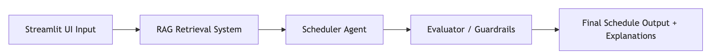
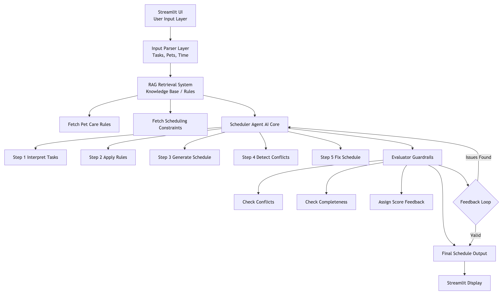
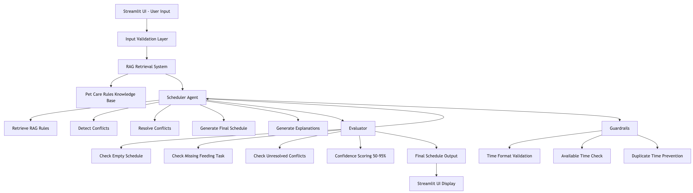
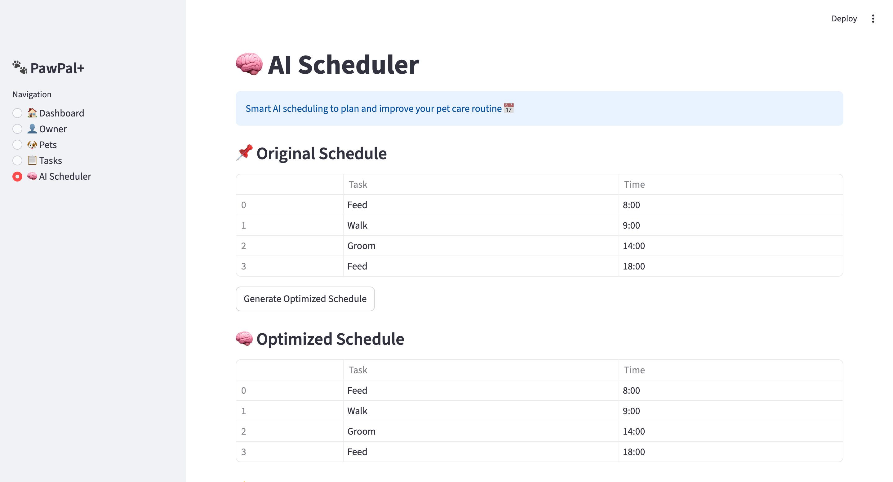
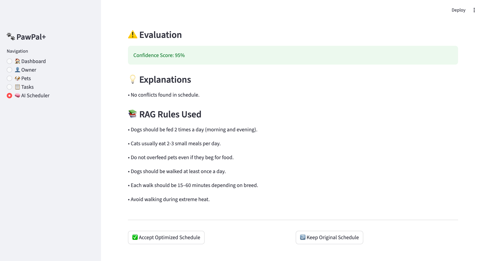
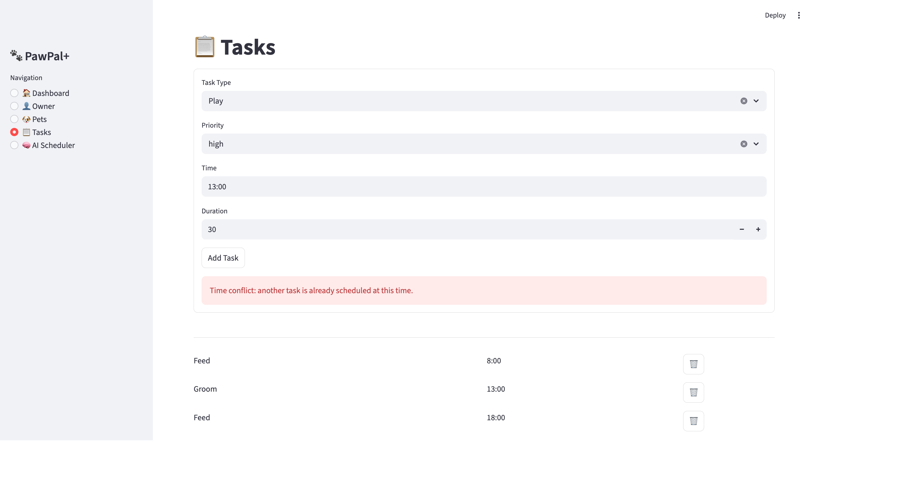
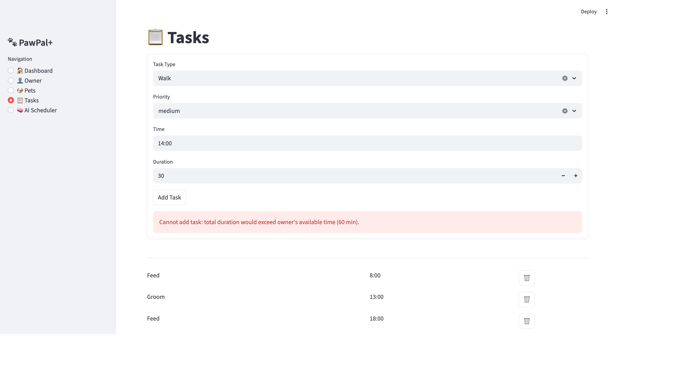

# PawPal+ (Project 4: Applied AI System)

**PawPal+** is a Streamlit app that helps a pet owner plan daily care tasks using an AI scheduling pipeline built on top of a base OOP scheduling system.

---

## Base Project vs. AI Upgrade

### Base Project (Module 2: PawPal+)
The original PawPal+ was a Python OOP scheduling system with:
- Owner, Pet, Task, and Scheduler classes
- Priority-based task scheduling (greedy algorithm)
- Time-based sorting and pet filtering
- Conflict detection and recurring task support
- Full test suite (22 unit tests)

### AI Upgrade (Project 4: Applied AI System)
This version adds a full AI pipeline on top of the base system:

| Component      | Description                                      |
|----------------|--------------------------------------------------|
| **RAG System** | Retrieves relevant pet care rules from a knowledge base based on task context |
| **Scheduler Agent** | Multi-step AI agent: detects conflicts, fixes them, and explains changes |
| **Evaluator** | Scores schedule quality (50–95% confidence), flags issues, and logs results |
| **Guardrails** | Input validation, duplicate time prevention, and available time enforcement |

---

## System Architecture

The system starts from the Streamlit UI where the user inputs pets and tasks. The RAG module retrieves relevant pet care rules to provide context for scheduling decisions. The Scheduler Agent then processes the tasks, detects conflicts, and applies fixes. After that, the Evaluator checks the schedule quality, applies guardrails, and assigns a confidence score. Finally, the system returns the optimized schedule along with explanations.

### System Overview Diagram


This diagram shows the high-level AI pipeline from input to final output.


### Initial System Architecture (Design Phase)


This diagram shows the original planned design before implementation.


### Final System Architecture (Implemented System)


This diagram reflects the actual implemented AI pipeline in PawPal+.

---

## Quick Start

### 1. Setup

```bash
python -m venv .venv
source .venv/bin/activate  # Windows: .venv\Scripts\activate
pip install -r requirements.txt
```

### 2. Run the App

```bash
streamlit run app.py
```

### 3. Run Tests

```bash
python -m pytest
```

---

## Demo Video

A full walkthrough of the PawPal+ system is available here:

[Watch Demo Video] (https://www.loom.com/share/339ffe5e19d94c5db1c7b72af0a804e0)

The video shows:
- End-to-end system run
- Task input → AI scheduling output
- Conflict detection and resolution
- RAG and evaluator behavior

---

## Presentation
[View Presentation](https://scedu-my.sharepoint.com/:p:/g/personal/edale_miguel_seattlecolleges_edu/IQAdXlfIT6UqS4fZAU820hnPAQJ-CsnSMYxuYADpNDMm1To?e=JWI5fd)

---

## How to Use

1. **Owner** — Set owner name and available time (in minutes)
2. **Pets** — Add one or more pets with name and species
3. **Tasks** — Add tasks with type, priority, time (HH:MM), and duration
4. **AI Scheduler** — Click "Generate Optimized Schedule" to run the full AI pipeline
5. Review the optimized schedule, evaluation score, explanations, and RAG rules used
6. Accept or reject the optimized schedule

---

## Example Inputs and Outputs

### Example 1 — No Conflicts

**Input tasks:**

| Task | Time | Duration | Priority |
|---|---|---|---|
| Feed | 8:00 | 15 min | high |
| Walk | 9:00 | 30 min | medium |
| Groom | 14:00 | 60 min | low |
| Feed | 18:00 | 15 min | high |

Available Time = 120mins

**Output:**




---

### Example 2 — Conflict Detected and Fixed

**Input tasks:**

| Task | Time | Duration | Priority |
|---|---|---|---|
| Feed | 8:00 | 15 min | high |
| Groom | 13:00 | 30 min | medium |
| Feed | 18:00 | 15 min | high |
| Play | 13:00 | 30 min | high |

Available Time = 120mins

**Output:**



---

### Example 3 — Guardrail Triggered

**Input:** Owner has 60 min available. Three tasks totaling 60 min already added. New task with 30 min duration.

**Output:**



---

## AI Features

### RAG (Retrieval-Augmented Generation)
- **File:** `agent/rag/rag_knowledge_base.py`, `agent/rag/rag_retriever.py`
- A static knowledge base of 13 pet care rules across 4 categories (feeding, walking, medication, scheduling)
- Rules are retrieved based on keywords in the current task list and displayed alongside the schedule output

### Scheduler Agent
- **File:** `agent/scheduler_agent.py`
- Runs a 6-step pipeline:
  1. RAG rule retrieval
  2. Conflict detection (exact time matches)
  3. Conflict resolution (shifts conflicting task +1 hour)
  4. Evaluation
  5. Explanation generation
  6. Structured output

### Evaluator
- **File:** `evaluator/evaluator.py`
- Validates schedules for: empty schedule, unresolved conflicts, missing feeding task
- Assigns a confidence score (50–95%) based on detected issues
- Logs results to `logs/system_log.txt`

### Guardrails

- **Duplicate time prevention** — blocks adding a task if another task already exists at the same time  
- **Available time enforcement** — blocks task creation if total duration exceeds owner's available time  
- **Time format validation** — enforces strict `HH:MM` format (rejects invalid inputs before they reach the AI scheduler)  
- **Time boundary rules** — allows only valid times (`00:00–24:00`, with `24:00` as the only valid end-of-day value)  
- **Non-destructive scheduling** — AI agent uses a safe copy of the schedule to avoid modifying original data  
- **Input safety layer** — empty or malformed time inputs are blocked with user feedback  


### Design Decisions
The system uses a rule-based RAG and heuristic scheduling approach instead of machine learning to keep the system lightweight, explainable, and easy to debug. A greedy scheduling strategy with simple conflict shifting was chosen to ensure predictable and fast results.

---

## Features

**Base System:**
- **Task Management** – Add and remove pet care tasks per pet
- **Priority-Based Scheduling** – AI scheduler prioritizes high-importance tasks during optimization
- **Time-Based Sorting** – Sorts by HH:MM; tasks without a time are placed last
- **Multi-Pet Support** – Combines tasks across multiple pets under one owner
- **Recurring Tasks** – Automatically reschedules daily (+1 day) and weekly (+7 days) tasks
- **Task Completion Tracking** – Completed tasks are excluded from scheduling
- **Filtering by Pet** – View tasks for a specific pet

**AI Additions:**
- **Conflict Detection and Resolution** – Agent detects and fixes time conflicts automatically
- **Schedule Evaluation** – Confidence score and issue feedback after every optimization
- **RAG Rule Retrieval** – Relevant pet care guidelines surfaced per session
- **Audit Logging** – Evaluation results written to log file after each run
- **Accept / Reject Flow** – User reviews optimized schedule before applying it

---

## Testing

```bash
python -m pytest
```

### What is tested (33 tests total, all passing)

**Base system tests (`tests/test_pawpal.py` — 22 tests):**
- Task sorting by time and priority
- Recurring tasks (daily and weekly)
- Conflict detection
- Plan generation with limited available time
- Edge cases (empty pets, zero available time, duplicate tasks)

**AI system tests (`tests/test_scheduler_agent.py` — 11 tests):**
- RAG rule retrieval for different keywords
- Agent conflict detection and fixing
- Explanation generation
- Multi-pet scheduling scenarios
- Full pipeline execution
- Invalid time format handling

### Confidence Level
★★★★★ (5/5) — All 33 tests pass

---

## UML Diagrams

### Initial UML Diagram


### Final UML Diagram


---

## Project Structure

```
applied-ai-system-project/
├── app.py                     # Streamlit UI
├── pawpal_system.py           # Core OOP system (Owner, Pet, Task, Scheduler)
├── main.py                    # CLI demo
├── agent/
│   ├── scheduler_agent.py     # AI Scheduler Agent (6-step pipeline)
│   └── rag/
│       ├── rag_knowledge_base.py  # Pet care rule knowledge base
│       └── rag_retriever.py       # Keyword-based rule retrieval
├── evaluator/
│   └── evaluator.py           # Schedule evaluator + confidence scoring
├── tests/
│   ├── test_pawpal.py         # Base system tests (22)
│   └── test_scheduler_agent.py  # AI pipeline tests (11)
├── assets/                    # System architecture + overview diagrams
├── images/                    # UML diagrams
├── .gitignore                 # Files excluded from GitHub (e.g., logs, cache)
├── README.md                  # Project documentation
├── reflection.md              # AI usage + design reflection
└── requirements.txt           # Python dependencies
```

---

## Notes

This project demonstrates how an OOP scheduling system can be extended with AI components — RAG retrieval, an agent pipeline, and an evaluation layer — while keeping the core system clean and independently testable.

## What This Project Says About Me

This project shows that I can design and build a full AI system, not just a single model or feature. I understand how to combine different components like retrieval, agent logic, and evaluation into one working pipeline. I can also structure systems in a modular way so each part is testable and independent. Overall, this reflects my ability to think like an AI systems engineer and build reliable end-to-end applications.

## Reflection

This project helped me understand how AI systems are built as pipelines rather than single models. I learned how retrieval systems (RAG) can improve decision-making by adding external knowledge instead of relying only on logic inside the code.

I also learned the importance of breaking AI systems into clear stages such as retrieval, reasoning, and evaluation. The Scheduler Agent showed how rule-based systems can simulate reasoning without using machine learning models.

A key challenge was keeping each component independent while still making them work together. I solved this by defining clear interfaces between the RAG module, Scheduler Agent, and Evaluator, and ensuring data flows cleanly between each stage.

I also learned the importance of guardrails in AI systems to prevent invalid inputs from reaching the scheduling logic, which helps improve system reliability and safety.

Overall, this project improved my understanding of system design, modular AI architecture, and debugging multi-step AI pipelines.
