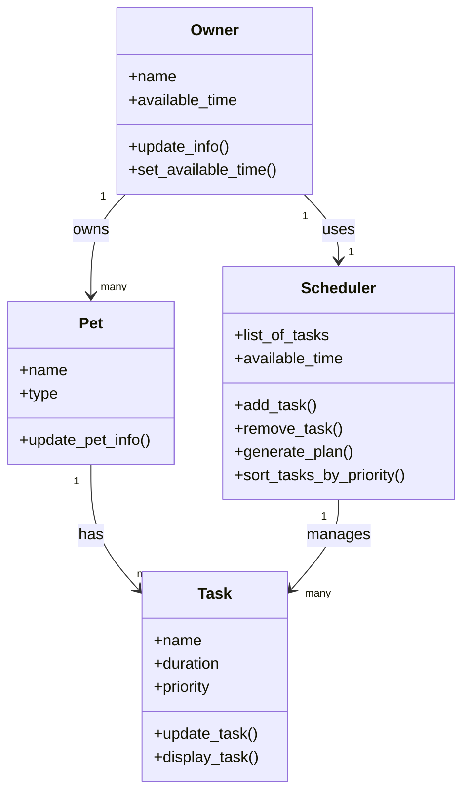

# PawPal+ Project Reflection

## 1. System Design

**a. Initial design**

- Briefly describe your initial UML design.

My initial UML design included four main classes: Owner, Pet, Task, and Scheduler.

- What classes did you include, and what responsibilities did you assign to each?

The Owner class is responsible for storing the user’s basic information and available time for pet care. The Pet class stores information about the pet, such as name and type. The Task class represents individual pet care activities, including name, duration, and priority. The Scheduler class is responsible for organizing tasks and generating a daily plan based on available time and task priority.

### My initial UML Diagram:

**b. Design changes**

- Did your design change during implementation?

Yes, the design changed during implementation.

- If yes, describe at least one change and why you made it.

Initially, tasks did not include time or date attributes. These were added later to support sorting, scheduling, and conflict detection. This change made it possible to organize tasks more realistically and detect when tasks happen at the same time.
Another change was updating the task completion logic to support recurring tasks. The mark_complete() method was modified to create the next occurrence for daily and weekly tasks. This improved the system by making it more automated and closer to real-life scheduling.

---

## 2. Scheduling Logic and Tradeoffs

**a. Constraints and priorities**

- What constraints does your scheduler consider (for example: time, priority, preferences)?

The scheduler considers task time, priority level, duration, and completion status. It also considers the owner’s available time when building a daily plan. Tasks with higher priority are considered first when creating the schedule. Time is used to sort and detect conflicts, while duration is used to fit tasks into the available schedule.

- How did you decide which constraints mattered most?

Priority and available time were chosen as the most important because they directly affect what gets done in a day.

**b. Tradeoffs**

- Describe one tradeoff your scheduler makes.

One tradeoff is that conflict detection only checks for exact matching start times. It does not detect overlapping task durations. This keeps the system simple and easy to understand, but it may miss some real scheduling conflicts.

- Why is that tradeoff reasonable for this scenario?

This tradeoff is reasonable because it reduces complexity and keeps the scheduler beginner-friendly while still catching the most common conflicts.

---

## 3. AI Collaboration

**a. How you used AI**

- How did you use AI tools during this project (for example: design brainstorming, debugging, refactoring)?
- What kinds of prompts or questions were most helpful?

**b. Judgment and verification**

- Describe one moment where you did not accept an AI suggestion as-is.
- How did you evaluate or verify what the AI suggested?

---

## 4. Testing and Verification

**a. What you tested**

- What behaviors did you test?
- Why were these tests important?

**b. Confidence**

- How confident are you that your scheduler works correctly?
- What edge cases would you test next if you had more time?

---

## 5. Reflection

**a. What went well**

- What part of this project are you most satisfied with?

**b. What you would improve**

- If you had another iteration, what would you improve or redesign?

**c. Key takeaway**

- What is one important thing you learned about designing systems or working with AI on this project?
